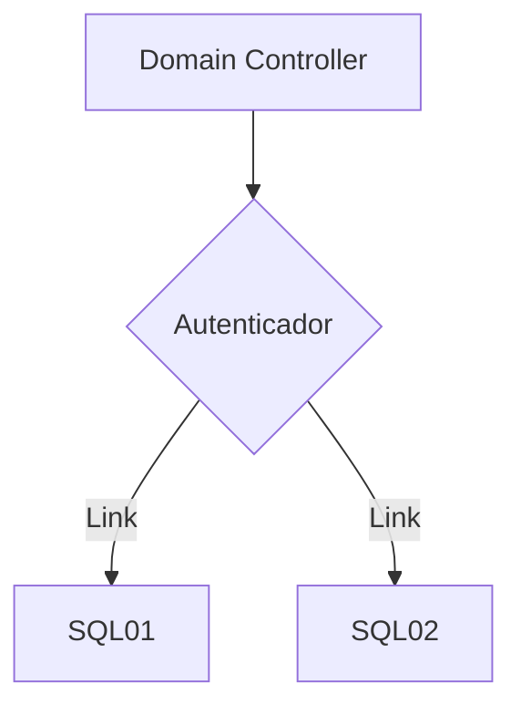

<h1>✅ DC01 promovindo a Domain Controller.</h1>

Já com os três servidores instalado o Sistema Operacional, precisamos alegar um deles como o Domain Controller.

:bell: Mas o que é Domain Controller ?

Ele vai ser o servidor que vai ter a função de autentificar, criar regrar e politicas de grupo, gerenciamento de diretório e disco. Agora referente ao serviço de SQL Server, o Domain Controller tem como funcionalidade de autenticar logins no SQL Server, controlar acessos de contas com suas devidas credenciais.

## Mermaid diagrams

<h1>:computer: Como criar um Domain por etapas: </h1>

Com os três servidores instalados e configurados, precisamos declarar um deles como o Domain Controller. Um detalhe que vamos observar é que o servidor contem IP fixo.

Logo vamos alterar o Computer Name e Domain. 
| Computer Name | Domain Name |
| --- | --- |
| DC01 | labsql.local |

A seguir o sistema operacional vai pedir para reiniciar.

A seguir vamos instalar uma nova features que é o Active Directory Domain com  

Na parte superior a esquerda se encontra com o computer nome e o domain

Na proxima etapa basta deixar como está no momento, porque vai ser apenas um servidor de Domain com algumas roles e features. 

No filtro vamos digitar o nome do servidor [DC01] e definir que esse servidor será o Domain Controller. \
A seguir vai apresentar o nome do servidor e o IP do mesmo.

Em Server Roles vamos deixar marcado apenas as seguintes opções.
* Active Directory Certificate Services. 

O confirmation é uma resumo de tudo que vai ser instalado no servidor \

Na aba de Results é o que foi instalado para ser declarado como Domain Controller. \

Ao finalizar, o Windows vai pedir para reiniciar o servidor, ao reiniciar vai apresentar como LABSQL\Administrator \
O prefixo LABSQL é o NetBIOS name do domínio que acabamos de criar. \
Isso confirma que o DC01 já está operando como Domain Controller do domínio labsql.local. \

<h1>✅ SQL01 e SQL02 ingressados no domínio. </h1>
A seguir, ao ligar o servidor basta ir na aba "local server" e depois trocar o nome do computar e domain \

 

E depois clicar em change e colocar os nomes do computador e o domain. \
 \
Ao confirmar isso, o proprio servidor vai indicar para reiniciar (Por favor fazer isso para validar) \
Repetir esse processo para o servidor SQL02

Uma observação: Ao concluir em colocar todos os servidores no domain. \
Testar resolução de nome completo (FQDN) entre os 3 servidores \

De qualquer uma das VMs, teste:  

ping SQL01.labsql.local \
ping SQL02.labsql.local \
ping DC01.labsql.local  

<h1>✅ Failover Clustering instalado nos 2 nós. </h1>

Isso precisa ser feito em SQL01 e SQL02 (não no DC01 — o DC não faz parte do cluster de failover do SQL).

Repita esse processo nas duas VMs (SQL01 e SQL02) e me avisa quando ambas tiverem o Failover Clustering instalado. \
Depois seguimos para a criação do cluster propriamente dito (via Failover Cluster Manager), que vai envolver validar a configuração e nomear o cluster. \

Ao logar no servidor basta ir server manager, add roles.

Vai abrir um pop-up \

vai sempre apontar o servidor em questão (Nesse caso é SQL01)

Na aba server roles não marcar em nada e seguir em frente 

Na aba features deixar marcado o Failover Cluster e next

E por ultimo vai ter a aba de Confirmation (que é um resumo do que vai ser instalado)

