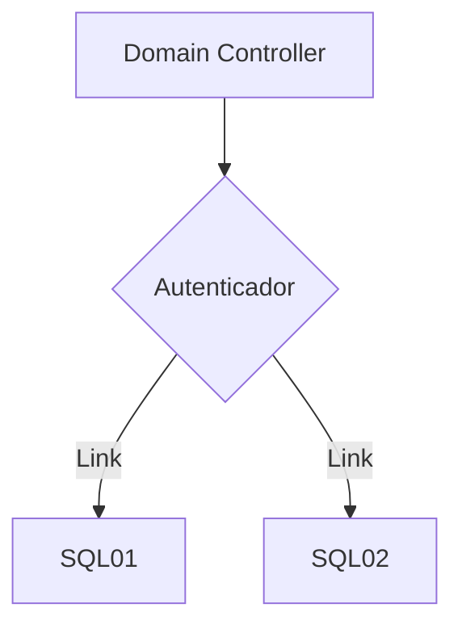

<h1>✅ DC01 promovido a Domain Controller.</h1>

Já com os três servidores instalado o Sistema Operacional, precisamos alegar um deles como o Domain Controller.

:bell: Mas o que é Domain Controller ?

Ele vai ser o servidor que vai ter a função de autentificar, criar regrar e politicas de grupo, gerenciamento de diretório e disco. Agora referente ao serviço de SQL Server, o Domain Controller tem como funcionalidade de autenticar logins no SQL Server, controlar acessos de contas com suas devidas credenciais.

## Mermaid diagrams

<h1>:computer: Como criar um Domain por etapas: </h1>
